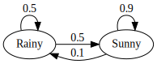
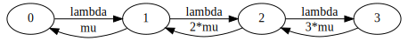

# Markov Solver
*Utility to solve Markov Chains.*

## Requirements
* Python 3.6+

## Install
Install the package, running:
```shell
pip install markov-solver
```

## Usage

### Chain with constant transition rates
Let us image that we want to solve the following Markov chain:



We should create a YAML file that defines the chain:
```yaml
chain:
  - from: "Sunny"
    to: "Sunny"
    value: "0.9"

  - from: "Sunny"
    to: "Rainy"
    value: "0.1"

  - from: "Rainy"
    to: "Rainy"
    value: "0.5"

  - from: "Rainy"
    to: "Sunny"
    value: "0.5"
```

Then, running the following command:
```shell
markov-solver solve --definition [PATH_TO_DEFINITION_FILE]
```

We obtain the following result:
```
===============================================================
                     MARKOV CHAIN SOLUTION
===============================================================

                      states probability
Rainy.........................................0.166666666666667
Sunny.........................................0.833333333333333
```

### Chain with symbolic transition rates
Let us image that we want to solve the following Markov chain:



We should create a YAML file that defines the chain:
```yaml
symbols:
  lambda: 1.5
  mu: 2.0

chain:
  - from: "0"
    to: "1"
    value: "lambda"

  - from: "1"
    to: "2"
    value: "lambda"

  - from: "2"
    to: "3"
    value: "lambda"

  - from: "3"
    to: "2"
    value: "3*mu"

  - from: "2"
    to: "1"
    value: "2*mu"

  - from: "1"
    to: "0"
    value: "mu"
```

Then, running the following command:
```shell
markov-solver solve --definition [PATH_TO_DEFINITION_FILE]
```

We obtain the following result:
```
===============================================================
                     MARKOV CHAIN SOLUTION
===============================================================

                      states probability
0.............................................0.475836431226766
1.............................................0.356877323420074
2.............................................0.133828996282528
3............................................0.0334572490706320
```

## Authors
Giacomo Marciani, [mgiacomo@amazon.com](mailto:mgiacomo@amazon.com)

## References
* ["Discrete-Event Simulation", 2006, L.M. Leemis, S.K. Park](https://www.amazon.com/Discrete-Event-Simulation-Lawrence-M-Leemis/dp/0131429175)
* ["Performance Modeling and Design of Computer Systems, 2013, M. Harchol-Balter](https://www.amazon.com/Modeling-Simulation-Discrete-Event-Systems-ebook/dp/B00EMB3MXA)

## License
The project is released under the [MIT License](https://opensource.org/licenses/MIT).
